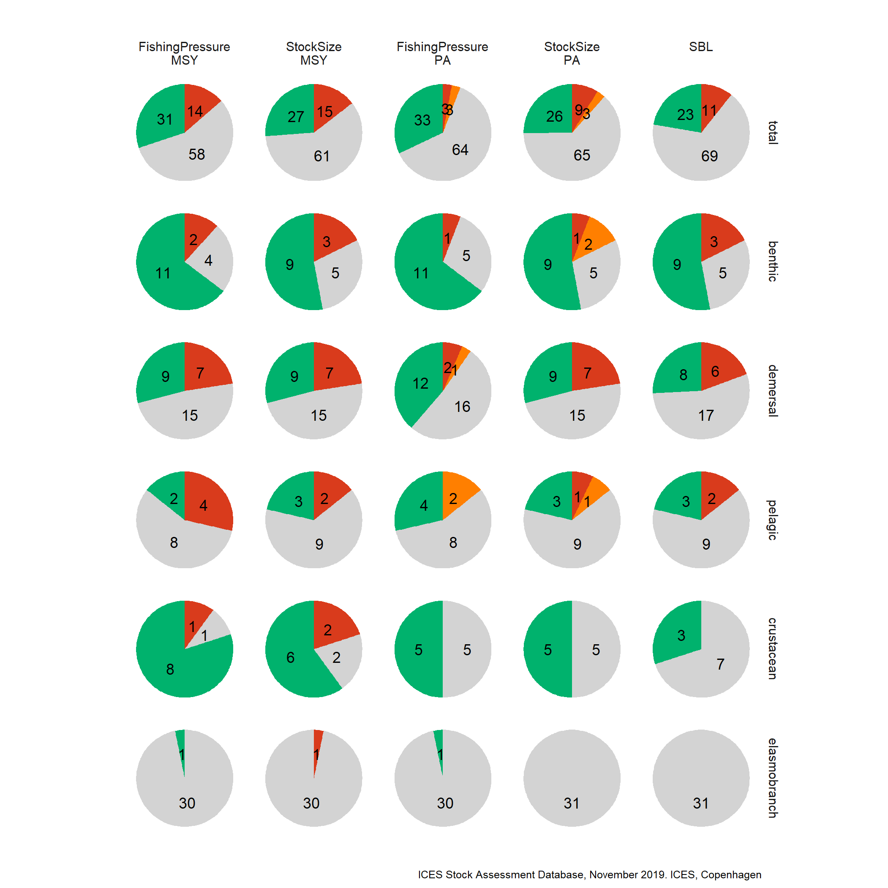
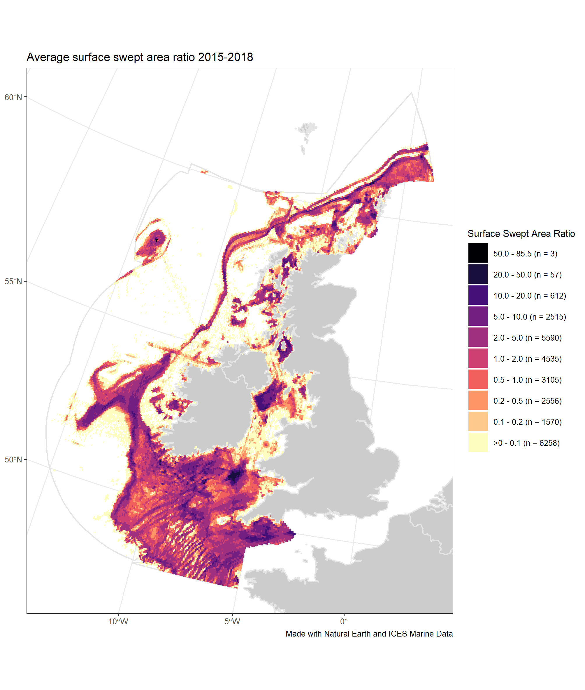

2019\_CS\_FisheriesOverview
================

## List of plots in report folder:

### FO\_Figure1

### FO\_Figure2

### FO\_Figure3

### FO\_Figure4

### FO\_Figure5

### FO\_Figure6

### FO\_Figure7

### FO\_Figure8

### FO\_Figure9

### FO\_Figure11

### FO\_Figure12

### FO\_Figure13a

### FO\_Figure13b

### FO\_Figure13c

### FO\_Figure13d

### FO\_Figure14\_All

### FO\_Figure14\_benthic

### FO\_Figure14\_crustacean

### FO\_Figure14\_demersal

### FO\_Figure14\_pelagic

### FO\_Figure17a

### FO\_Figure17b

